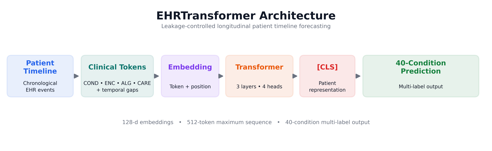

# M31 Patient Timelines

A lightweight **Transformer-based longitudinal EHR model** for predicting newly diagnosed future clinical conditions from patient timelines.

## Approach

Patient histories are converted into chronological clinical-event sequences with explicit temporal-gap tokens.

**EHRTransformer:**

* 128-dimensional embeddings
* 4 attention heads
* 3 Transformer layers
* 512-token maximum sequence length
* 40-condition multi-label prediction


*Figure 1: Patient timelines are converted into clinical-event and temporal-gap tokens, represented using learned token and positional embeddings, processed by a three-layer Transformer encoder, and summarized using the [CLS] representation for 40-condition multi-label prediction.*

Timelines are truncated at an anchor date **five years before the patient's final recorded encounter** to prevent data leakage.

The model uses `conditions`, `encounters`, `allergies`, and `careplans` data with a custom **209-token vocabulary** and seven categorical temporal intervals.

## Training

The model is trained from scratch using:

* AdamW (`1e-4` learning rate)
* Focal Loss with BCE-with-logits
* Dynamic positive-class weighting
* Batch size: 32
* Early stopping based on validation macro-AUROC
* Automatic mixed precision and memory optimization

No external datasets or pretrained weights were used.

## Validation Results

Test labels are withheld for independent scoring. The following results are from the held-out validation cohort at the optimal early-stopping checkpoint (Epoch 21).

| Metric      | Validation |
| ----------- | ---------: |
| Macro AUROC | **0.6642** |
| mAP         | **0.1344** |
| Macro F1    | **0.1380** |
| Brier Score | **0.1953** |

## Repository Structure

```text
m31-patient-timelines/
├── assets/
│   └── architecture_diagram.png
├── src/
│   ├── build_labels.py
│   ├── build_sequences.py
│   ├── build_test_sequences.py
│   ├── build_vocab.py
│   ├── dataset.py
│   ├── filter_timeline.py
│   ├── model.py
│   ├── predict.py
│   └── train.py
├── predictions.csv
├── upload_model.py
└── README.md